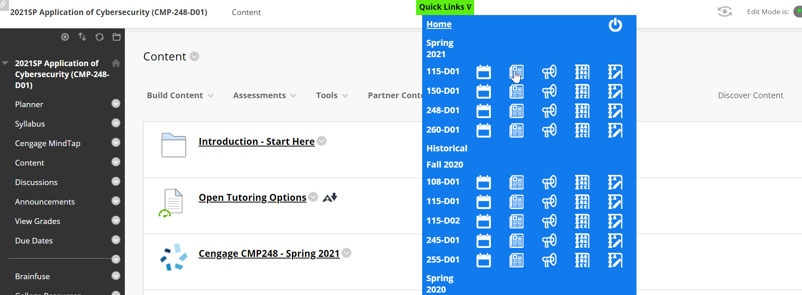
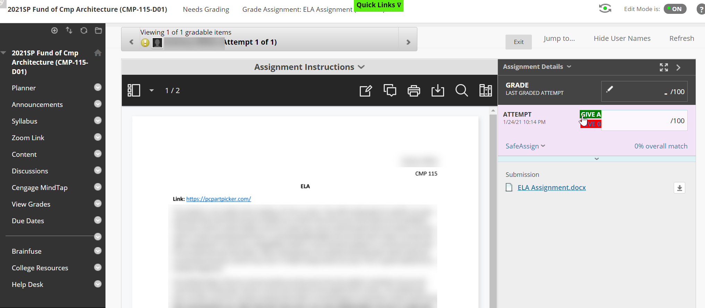

# BlackBoardHelper
A "helper" for navigating Blackboard and giving 100 or 0 quickly on assignments.
Quick Links Menu: Has links per class for Planner, Content, Announcements, Full Grade Center and Ungraded Items

In the image below you see the quick menu expanded:

In the image below you see me about to give the student an A.  It will fill in the grade of full points for whatever the full points are for that assignment and press enter to go to the next student.

Instructions for Installation
1. Get "User Javascript & CSS" plugin for chrome (or a similar one for whichever browser).
2. For the url in the plugin, use your school's URL.  For example, mine is Worwic.Blackboard.com
3. Download the javascript file (BlackBoardHelper.js) for implementing in the javascript section.
4. Download the CSS file (BlackBoardHelper.css) for implementing in the CSS section.

Instructions for Setup
You will need to change the top portion of the javascript file for your classes and content areas.
1. For each course, change the Semester and Name to whatever you'd like.
2. To find the content_id and course_id for a course, navigate to the BB course, right click on the content and open in new window.  Here you will see the full URL with both ID's.  Plug em into the file in the appropriate window.
3. Historical Courses is the same, just for older courses.
4. In the javascript, change all URL's like "worwic.blackboard.com" to the same links on your Blackboard installation.
5. Icons are located on my own server (resources.matice.com) - feel free to continue using them there.

Usage
1. When you log into Blackboard, if the Quick Menu does not show up, press the ` key (the tilde key unshifted - top left on the keyboard)
2. Hover over the menu and use as needed.
3. Some areas of Blackboard (like the "Courses" page and others not related to specific courses) are not generated in a standard method and will likely break if the Quick Menu is "on".  In this case, press the Quick Menu and hit the power button.  This will disable the loading of the functions until you reload it with the ` key.  You will have to refresh the page after turning off the Quick Menu.
